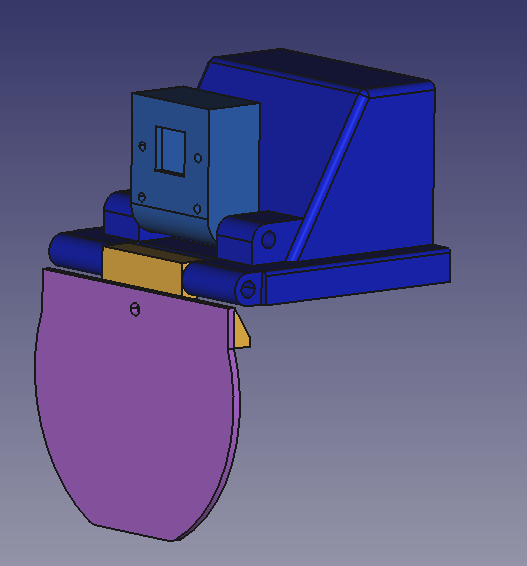
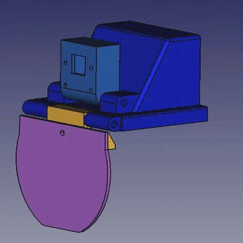
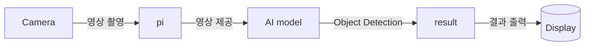

# Project AIpex


### GLAUX(AI helmet with AR HMD)
 - GLAUX는 고대 그리스어로 '올빼미(Owl)'를 뜻합니다.
 - 상징성 : 올빼미는 예로부터 지혜(Wisdom), 통찰력(Insight), 그리고 어둠 속에서도 진실을 꿰뚫어 보는 시야(Vision)를 상징합니다.
 - 제품 목표와의 연결: 저희 GLAUX는 단순한 정보 표시 장치가 아니라, AI를 통해 사용자에게 AI를 통해 가장 안전하고 효율적인 라이딩을 위한 지능적인 통찰력과 정보를 제공하여, 라이더의 인지 능력을 증강시키려는 목표를 담고 있습니다. 따라서 이 강력한 상징을 이름으로 채택하게 되었습니다.
### GLAUX의 기술적 정체성: 핵심 가치의 이니셜
 - **G** : Guidance 
 - **L** : Logic
 - **A** : Augmented
 - **U** : Unified
 - **X** : X-Vision

## Concept arts
  |||
  |----|----|
  |||

## 핵심내용

* AI를 활용한 주행보조 기능(Object Detection , Navigation ,…)
* AR HMD(Augmented Reality Head Mounted Display)를 통한 시각정보 제공

## 제안배경 및 목적
* 최근 AI 기술의 급격한 발전은 다양한 산업 분야에 혁신적인 변화를 가져왔으며, 그중에서도 **자동차 산업**이 가장 큰 영향을 받고 있습니다. 이로 인해 글로벌 기업들은 **자율주행 기술, AI 음성인식, 스마트 크루즈 컨트롤, 긴급 자동 제동 시스템(AEB)** 등 첨단 AI 기능을 차량에 적용하여 운전자 편의성과 안전성을 크게 향상시키고 있습니다.
 이러한 자동차 산업의 변화에 주목한 저희 팀은, **AI 기술이 제공하는 편의성과 안전 기능을 자동차 이외의 이동수단에도 확대 적용할 수 없을까**라는 문제의식에서 출발했습니다. 거기에 더해 종로 캠퍼스에서 배운 임베디드 기술 또한 유용하게 활용하여 AI, 임베디드 등의 모든 기술을 담은 서비스를 기획해보고자 하였습니다.
 다양한 논의 끝에, **AI 주행보조 기술을 탑재한 AR 헬멧**이라는 솔루션을 기획하게 되었으며, 이를 통해 오토바이, 자전거 등 다양한 개인 이동수단 이용자에게 **보다 안전하고 편리한 주행 환경을 제공**하는 것을 목표로 본 프로젝트를 추진하게 되었습니다.

## 기대효과
### 경제적 기대 효과
* 자전거, 이륜차 등 다양한 이동수단에 운전 보조기능 제공
* 추후 타겟 고객층에 따라서 적합한 정보를 제공하는 AR기능 업데이트로 시장 확대
* 특별한 조작법 없이 AI가 탑재된 제품을 이용할 수 있어 디지털 취약세대에도 어필 가능


- 현재 시장에서 본 제품 ‘GLAUX’와 가장 유사한 컨셉을 보유한 기업은 **㈜세나테크놀로지**입니다. 세나는 2024년 기준 **매출 1,400억 원, 영업이익 176억 원**을 기록한 중견기업으로, 주요 제품군은 **아웃도어 스포츠용 블루투스 헤드셋과 스마트 헬멧**입니다. 기존 스마트 헬멧의 핵심 기능은 블루투스를 활용한 헬멧 착용자 사이의 무선통신입니다. GLAUX는 이러한 기존 제품들과 비교하여 확실한 특장점을 가지고 있는데, 그것은 **AI 기반의 고도화된 편의 기능**을 추가로 탑재하여 **차별화된 사용자 경험을 제공**하고자 하는 점입니다. 따라서 기존 웨어러블 스마트 기기 시장 내에서 높은 제품 경쟁력과 성장 잠재력을 확보할 수 있을 것으로 기대됩니다.
- 또한 세나의 매출 구조를 보면, 유럽 및 미국 시장이 전체 매출의 81.08%를 차지하고 있습니다. 이는 세나가 이미 주요 해외 시장에서 검증된 유통망과 브랜드 신뢰도를 보유하고 있음을 의미합니다. 이러한 글로벌 네트워크를 활용한다면, ‘GLAUX’와 같은 혁신적인 신제품을 통해 기존 고객층을 확장하고, 추가적인 외화 수익 창출과 기업 성장의 가속화가 가능할 것으로 판단됩니다.


- 또 다른 유사 사례로는 이스라엘 기업 에브리사이트(Everysight)의 스마트 글래스 ‘랩터(Raptor)’를 들 수 있습니다. 이스라엘은 국가 차원에서 **‘듀얼 유스(Dual-Use, 민군 겸용 기술)’** 전략을 핵심 산업정책으로 추진하고 있으며, 이를 통해 ‘방산 R&D → 민간 스타트업 → 글로벌 수출’로 이어지는 혁신 생태계를 구축하고 있습니다. 이 전략 아래에서 에브리사이트의 ‘랩터’는 원래 **군용 AR(증강현실) 기술**을 기반으로 개발되어, 이후 민간용 스포츠 AR 글래스로 상용화된 대표적인 성공 사례입니다. 반대로, 저희의 ‘GLAUX’는 **민간용 AI 스마트 헬멧 기술을 군 및 공공안전 분야로 확장**하는 **‘민간 → 군(역(逆) 듀얼 유스)’** 전략을 추구할 수 있습니다. 군용 AR 기술은 현재도 미국에서 추진하는 IVAS(Integrated Visual Augmentation System)같은 프로젝트를 통해 미래보병체계의 핵심기술 중 하나인 상태입니다.  국내 환경에 최적화된 국산 군용 AR개발이 이루어진다면, 저희 프로젝트 또한 자체제작 국산 데이터를 기반으로 하는 AR 서비스이기 때문에 큰 기여를 할 수 있다고 생각합니다.
 이를 통해 민간 시장의 기술 혁신성과 실용성을 기반으로, 향후 군·경찰·소방 등 특수 목적용 시장까지 진출할 수 있는 높은 확장 가능성을 지니고 있습니다.

### 사회적 기대 효과
  |||
  |----|----|
  |||


* 행정안전부가 발표한「2024년 기준 자전거 이용 현황」에 따르면, 2024년 자전거 교통사고는 **5,571건**으로, 전년 대비 **8.3%(425건) 증가**한 것으로 나타났습니다. 심지어 18세 미만 사상자는 1,647명으로 전년 대비 604명 증가했습니다. 이러한 수치는 자전거 이용 인구가 늘어나는 만큼 안전사고 예방을 위한 실질적 대책의 필요성이 커지고 있음을 보여줍니다. 본 제품 ‘GLAUX’는 **AI 기반 감지 체계와 후방 시야 보조 기능**을 탑재하여, 주행 중 위험 상황을 조기에 인지하고 경고함으로써 자전거 교통사고 발생률을 유의미하게 감소시킬 수 있을 것으로 기대됩니다. 또한 통계에 따르면, **자전거 교통사고 사망자의 60% 이상이 두부 손상으로 인한 사망**이며, 그럼에도 불구하고 **국내 헬멧 착용률은 평균 13.2%**에 불과합니다. 저희는 이러한 낮은 착용률의 원인 중 하나가, **기존 헬멧이 단순한 보호 장비에 그친다**는 점에 있다고 분석했습니다. 이에 반해 GLAUX는 보호 기능뿐 아니라 AI 기반의 다양한 부가 기능을 제공함으로써, 사용자가 **‘안전을 위해 헬멧을 써야 하기 때문이 아니라, 기능을 사용하기 위해 헬멧을 착용하여 안전이 확보된다’**라는 새로운 패러다임을 제시하고자 합니다.
 따라서 본 제품의 보급은 단순한 안전장비의 확산을 넘어 **헬멧 착용 문화의 활성화** 및 **교통안전 개선 효과**까지 기대할 수 있습니다.


## Clone code

* (각 팀에서 프로젝트를 위해 생성한 repository에 대한 code clone 방법에 대해서 기술)

```shell
git clone https://github.com/AIpex-sesac/AIpex.git
```

## Prerequite

* (프로잭트를 실행하기 위해 필요한 dependencies 및 configuration들이 있다면, 설치 및 설정 방법에 대해 기술)

```shell
python -m venv .venv
source .venv/bin/activate
pip install -r requirements.txt
```

## Steps to build

* (프로젝트를 실행을 위해 빌드 절차 기술)

```shell
cd ~/xxxx
source .venv/bin/activate

make
make install
```

## Steps to run

* (프로젝트 실행방법에 대해서 기술, 특별한 사용방법이 있다면 같이 기술)

```shell
cd ~/xxxx
source .venv/bin/activate

cd /path/to/repo/xxx/
python demo.py -i xxx -m yyy -d zzz
```

## Output

* (프로젝트 실행 화면 캡쳐)

## Design
### 헬멧 부착물 개별 이미지
  |||
  |----|----|
  |||
  |||

### 헬멧 전체 이미지
  ||||
  |----|----|----|
  ||||
  ||||

## Appendix

* (참고 자료 및 알아두어야할 사항들 기술)

## Dataset and Model
* 직접 카메라가 부착된 헬멧을 착용하고 한강변을 촬영하여 데이터 수집
* intel geti를 활용하여 labeling 진행
### Model
* YoloX
* 실시간 영상에 대응하기 위해 처리속도가 빠른 모델 채용
### Classes
1. bike
2. person
3. car

## 팀원 소개 및 역할 분담
  | Name | Role |
  |----|----|
  | 남대문 | Development |
  | 성시경 | Data management, 3D Modeling |
  | 장태규 | Project lead, Architect |
  | 최종인 | UI design, Development |

## Google Drive

```shell
https://drive.google.com/drive/folders/1Qj72MTF6LtFqe8MISK7nzGTvX0vuPtUF?usp=drive_link
```
