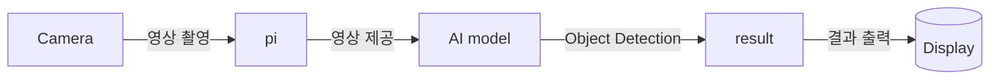

# Project AIpex

* AI Object Detection이 탑재된 스마트 AI 헬멧 올빼미 개발

## Concept arts


## 핵심내용

* 네비게이션, 후방 카메라 등 자동차의 편의기능을 헬멧에 탑재하여 착용자가 이용 가능
* 헬멧에 부착한 HUD 스크린을 통해 Object Detection 결과/편의기능 UI 등을 증강현실 형태로 제공

## 제안배경 및 목적
* AI가 급격히 부상하며 가장 큰 영향을 받은 분야 중 하나는 **자동차**입니다. 수많은 기업에서 자율주행 기능을 개발하고 있고, 시판 중인 차량들도 AI 음성인식, 스마트 크루즈, AI 긴급제동 등 다양한 기능들을 탑재하고 있습니다. 이러한 자동차 업계의 현황을 보고 저희 팀은 AI로 인해 얻게 된 이런 다양한 편의기능들을 자동차가 아닌 다른 이동수단에서도 이용할 수 있으면 좋겠다는 발상을 얻었습니다. 어떻게 이 발상을 현실화할 수 있는지 토의한 결과 **AI를 탑재한 스마트 헬멧**이라는 결론을 얻어 이렇게 개발에 착수하게 되었습니다.

## 기대효과
* 자전거, 이륜차 등 다양한 이동수단에 운전 보조기능 제공
* 추후 타겟 고객층에 따라서 적합한 정보를 제공하는 AR기능 업데이트로 시장 확대
* 특별한 조작법이나 기술 스택 요구 없이 AI가 탑재된 제품을 이용할 수 있어 디지털 취약세대에도 어필 가능


* 행정안전부가 공표한 ‘2024년 기준 자전거 이용 현황’에 따르면 자전거 교통사고가 2023년 대비 8.3%(425건) 증가한 5,571건 발생했다고 하는데, 올빼미가 유통된다면 내장된 감지 및 후방 확인 기능을 통해 교통사고 발생량을 유의미하게 감소시킬 수 있을 것으로 기대됩니다.

## Clone code

* (각 팀에서 프로젝트를 위해 생성한 repository에 대한 code clone 방법에 대해서 기술)

```shell
git clone https://github.com/AIpex-sesac/AIpex.git
```

## Prerequite

* (프로잭트를 실행하기 위해 필요한 dependencies 및 configuration들이 있다면, 설치 및 설정 방법에 대해 기술)

```shell
python -m venv .venv
source .venv/bin/activate
pip install -r requirements.txt
```

## Steps to build

* (프로젝트를 실행을 위해 빌드 절차 기술)

```shell
cd ~/xxxx
source .venv/bin/activate

make
make install
```

## Steps to run

* (프로젝트 실행방법에 대해서 기술, 특별한 사용방법이 있다면 같이 기술)

```shell
cd ~/xxxx
source .venv/bin/activate

cd /path/to/repo/xxx/
python demo.py -i xxx -m yyy -d zzz
```

## Output

* (프로젝트 실행 화면 캡쳐)
* 현재 샘플 디자인
### 헬멧 부착물 개별 이미지


### 헬멧 전체 이미지


## Appendix

* (참고 자료 및 알아두어야할 사항들 기술)

## Dataset and Model
* 직접 카메라가 부착된 헬멧을 착용하고 한강변을 촬영하여 데이터 수집
* intel geti를 활용하여 labeling 진행
### Model
* YoloX
* 실시간 영상에 대응하기 위해 처리속도가 빠른 모델 채용
### Classes
1. bike
2. person
3. car

## 팀원 소개 및 역할 분담
  | Name | Role |
  |----|----|
  | 남대문 | Development |
  | 성시경 | Data management, 3D Modeling |
  | 장태규 | Project lead, Architect |
  | 최종인 | UI design, Development |

## Google Drive

```shell
https://drive.google.com/drive/folders/1Qj72MTF6LtFqe8MISK7nzGTvX0vuPtUF?usp=drive_link
```
