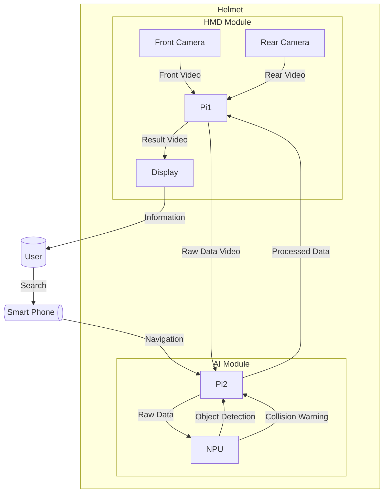
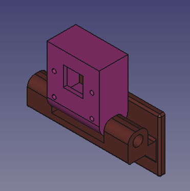
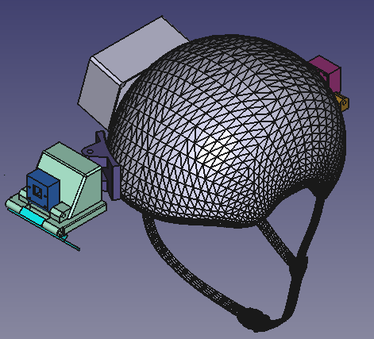
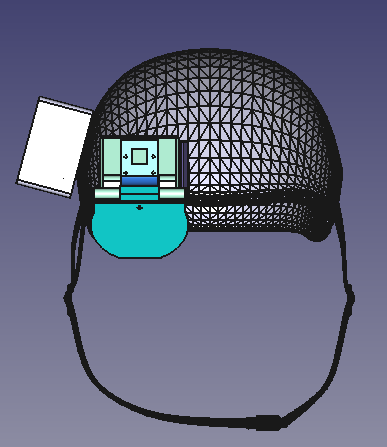
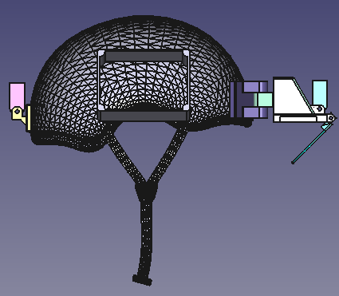
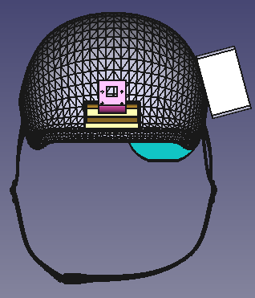
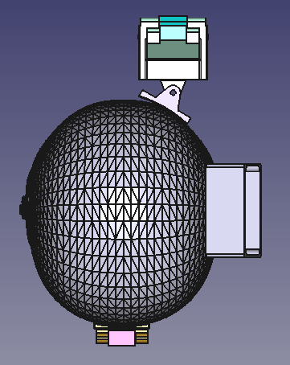
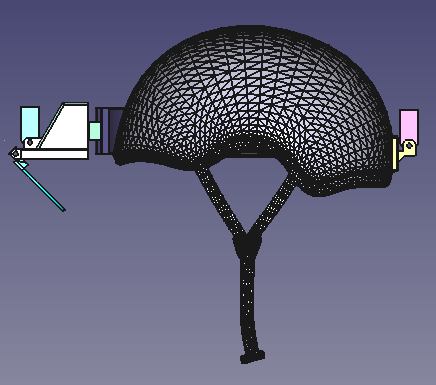
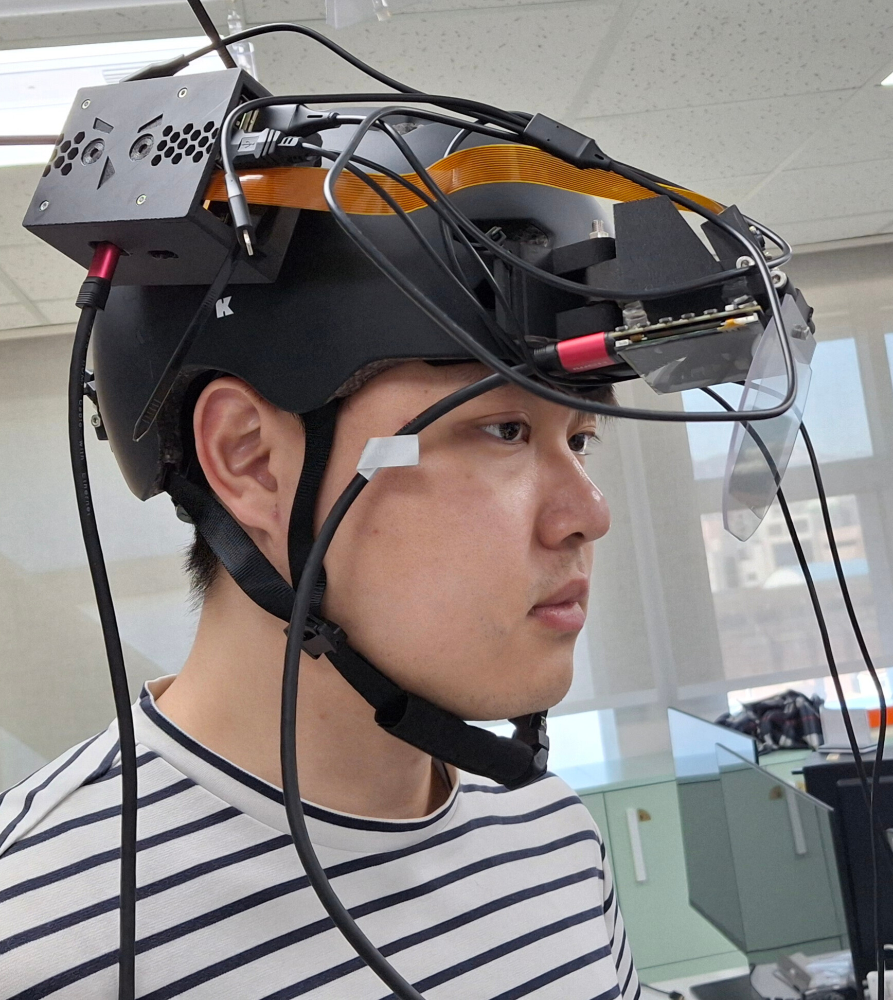

# Project AIpex
## 팀원 소개
  | Name | Role |
  |----|----|
  | 남대문 | Development |
  | 성시경 | Data management, 3D Modeling |
  | 장태규 | Project lead, Architect |
  | 최종인 | UI design, Development |

## 개요


### GLAUX(AI helmet with AR HMD)
 - GLAUX는 고대 그리스어로 '올빼미(Owl)'를 뜻함.
 - 상징성 : 올빼미는 지혜(Wisdom), 통찰력(Insight), 그리고 진실을 꿰뚫어 보는 시야(Vision)를 상징.
 - 제품 목표와의 연결: GLAUX는 단순한 정보 표시 장치가 아니라, 사용자에게 AI를 통해 가장 안전하고 효율적인 라이딩을 위한 지능적인 통찰력과 정보를 제공하여, 라이더의 인지능력 증강을 목표로 함. 따라서 이 강력한 상징을 이름으로 채택.
### GLAUX의 기술적 정체성: 핵심 가치의 이니셜
 - **G** : Guidance 
 - **L** : Logic
 - **A** : Augmented
 - **U** : Unified
 - **X** : X-Vision

## 핵심내용

* AI를 활용한 주행보조 기능 (Object Detection, Navigation, Rear Collision Warning)
* AR HMD(Augmented Reality Head Mounted Display)를 통한 시각정보 제공

## 제안배경 및 목적
* 최근 AI 기술의 급격한 발전은 다양한 산업 분야에 혁신적인 변화를 가져왔으며, 그중에서도 **자동차 산업**이 가장 큰 영향을 받고 있음. 이로 인해 글로벌 기업들은 **자율주행 기술, AI 음성인식, 스마트 크루즈 컨트롤, 긴급 자동 제동 시스템(AEB)** 등 첨단 AI 기능을 차량에 적용하여 운전자 편의성과 안전성을 크게 향상.
* 이러한 자동차 산업의 변화에 주목한 저희 팀은, **AI 기술이 제공하는 편의성과 안전 기능을 자동차 이외의 이동수단에도 확대 적용할 수 없을까**라는 문제의식에서 기획 출발. 거기에 더해 종로 캠퍼스에서 배운 임베디드 기술 또한 유용하게 활용하여 AI, 임베디드 등의 모든 기술을 담은 서비스를 기획.
* 다양한 논의 끝에, **AI 주행보조 기술을 탑재한 AR 헬멧**이라는 솔루션을 기획하였으며, 이를 통해 오토바이, 자전거 등 다양한 개인 이동수단 이용자에게 **보다 안전하고 편리한 주행 환경을 제공**하는 것을 목표로 본 프로젝트를 추진.

## Process Flow Diagram (흐름도)

## 제품 디자인
### 헬멧 부착물 개별 이미지
  |||
  |----|----|
  |||

### 헬멧 전체 디자인 이미지
  ||||
  |----|----|----|
  ||||
  ||||

### 1차 MVP 이미지
  ||||
  |----|----|----|
  ||||

#### 1차 피드백
* 카메라 ffc 케이블 보호 방안 필요
* HDMI/전원 케이블 정리 방안 필요
* 부착물로 인한 헬멧 무게중심 이슈

## 기대효과
### 경제적 기대 효과
* 안전사고로 인한 사회적 비용 절감
* 구매력이 검증된 기존 시장 존재
* 군경 등 특수 분야까지 진출 가능한 확장성
#### 자전거 교통사고로 인한 비용 감소


- 2023년 도로교통사고로 인한 피해를 화폐가치로 환산하면 약 54조 595억 원.
- 추정된 피해금액은 같은 해 GDP의 2.25%에 해당. (출처: 한국교통연구원)
- 이 중 자전거 사고의 점유율은 6.1% .
- 단순 계산 시 자전거 사고로 인한 피해는 약  3조 3천억원. 

#### IoT웨어러블 스마트기기 시장현황 분석 및 비교
* (주)세나테크놀로지 : 매출 1,400억원, 영업이익 176억 원.
* 모터사이클용 무선통신기기(세계 60% 점유)
* 주요 제품군 : 아웃도어 스포츠용 블루투스 헤드셋, 스마트 헬멧.

||GLAUX(AI AR 헬멧)|세나(스마트 헬멧)|
|---|----|----|
|핵심가치|능동적 안전 및 생명보호|편의성 및 그룹통신|
|주요기능|실시간 AR HUD(속도, 방향, 객체정보)|Mesh/Bluetooth 인터콤,음악재생, 전화통화,GPS 음성안내|
|핵심기술|Edge Ai(Hailo Npu)기반 초저지연 Visual FW|Bluetooth 5.2|
|안전 시스템|접근 감지 능동 AR 경보|후방 LED 테일라이트 내장(후미등, 브레이크등)|
|정보전달방식|시각적 AR 정보(시선 내 HUD정보)|청각적 오디오 정보(스피커/ 이어폰)|
|사용자환경|복잡한 도심 주행 및 초저지연 안전 요구 환경|그룹 라이딩 및 장거리 통신환경|

**결론**
* GLAUX는 AI기반 감지 기술을 활용한 능동적 안전기능 탑재.
* 기존 통신 중심 제품과 명확한 차별점 확보.
* 세나가 주도하는 시장내 안전기술 우위
* 더 높은 제품 경쟁력과 성장 잠재력으로 틈새시장 공략

#### 확장 가능성 분석


- 또 다른 유사사례는 이스라엘 기업 에브리사이트(Everysight)의 스마트 글래스 ‘랩터(Raptor)’. 이스라엘은 국가 차원에서 **‘듀얼 유스(Dual-Use, 민군 겸용 기술)’** 전략을 핵심 사업으로 추진함. 이를 통해 ‘방산 R&D → 민간 스타트업 → 글로벌 수출’로 이어지는 혁신 생태계를 구축. ‘랩터’는 원래 **군용 AR(증강현실) 기술**을 기반으로 개발 이후 민간용 스포츠 AR 글래스로 상용화된 대표적 성공 사례.
- 본 제품은 민간용 AI 스마트 헬멧 기술을 군 및 공공안전 분야로 확장하는 **‘민간 → 군(역(逆) 듀얼 유스)’** 전략을 추구할 수 있음. 군용 AR 기술은 현재도 미국에서 추진하는 IVAS(Integrated Visual Augmentation System)같은 미래보병체계 프로젝트에 적용 중임.
- 국내 환경에 최적화된 국산 군용 AR이 개발된다면, 본 프로젝트 또한 자체제작 국산 데이터를 기반으로 하는 AR 서비스로서 큰 기여 가능.
- 민간 시장 기술 혁신성과 실용성을 기반으로 향후 **군·경찰·소방 등 특수 목적용 시장**까지 진출할 수 있는 높은 확장 가능성 보유.

### 사회적 파급(기대) 효과
- 헬멧 착용문화의 활성화 및 교통안전 개선


#### 안전 문화 개선
- AI기반 감지체계와 후방시야 보조기능을 탑재하여 주행 중 위험상황 조기 인지 및 경고 ➜ 자전거 교통사고 발생률의 유의미한 감소 기대
- 자전거 사고 사망원인의 60% 이상은 두부 손상. 반면 국내 헬멧 착용률 12.3% ➜ 자전거 이용자가 증가 추세이므로 안전사고 예방을 위한 실질적 대책이 필수 
- 보호기능뿐만 아니라 AI기반의 다양한 부가기능을 제공 ➜‘기능을 사용하기 위해 헬멧을 착용하여 안전이 확보된다’ ➜ 새로운 패러다임  제시
- 제품 보급 = 헬멧 착용문화의 활성화 및 교통안전 개선효과로 의미 확장


## 클론 코드

* (각 팀에서 프로젝트를 위해 생성한 repository에 대한 code clone 방법에 대해서 기술)

```shell
git clone https://github.com/AIpex-sesac/AIpex.git
```

## Prerequite

* (프로잭트를 실행하기 위해 필요한 dependencies 및 configuration들이 있다면, 설치 및 설정 방법에 대해 기술)

```shell
python -m venv .venv
source .venv/bin/activate
pip install -r requirements.txt
```

## 빌드 방법

* (프로젝트를 실행을 위해 빌드 절차 기술)

```shell
cd ~/xxxx
source .venv/bin/activate

make
make install
```

## 실행 방법

* (프로젝트 실행방법에 대해서 기술, 특별한 사용방법이 있다면 같이 기술)

```shell
cd ~/xxxx
source .venv/bin/activate

cd /path/to/repo/xxx/
python demo.py -i xxx -m yyy -d zzz
```

## 결과물

* (프로젝트 실행 화면 캡쳐)

## 데이터셋 및 활용 모델


* 실제 자전거 이용 중의 상황을 데이터로 학습시키기 위하여 자전거 주행 중 영상을 직접 촬영하여 데이터로 활용. 전방/후방 2종류의 영상을 촬영.
* 촬영된 영상 데이터를 초당 1컷으로 분할하여 사진 데이터로 변환.
### Model
* YoloX
* 실시간 영상에 대응하기 위해 처리속도가 빠른 모델 채용
### Classes
1. bike
2. person
3. car

## 참고자료
* (참고 자료 및 알아두어야할 사항들 기술)

## Google Drive

```shell
https://drive.google.com/drive/folders/1Qj72MTF6LtFqe8MISK7nzGTvX0vuPtUF?usp=drive_link
```
